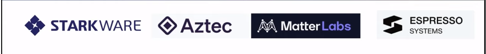
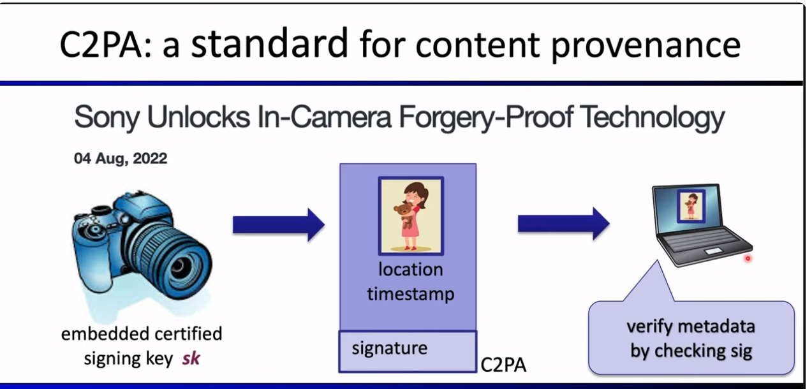
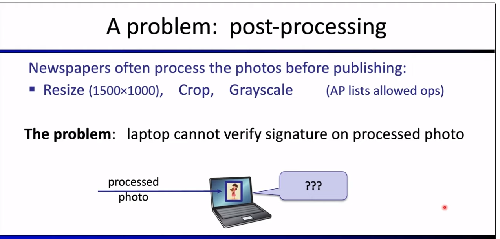
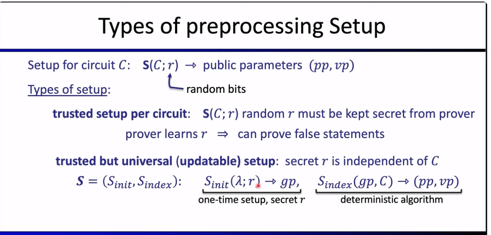
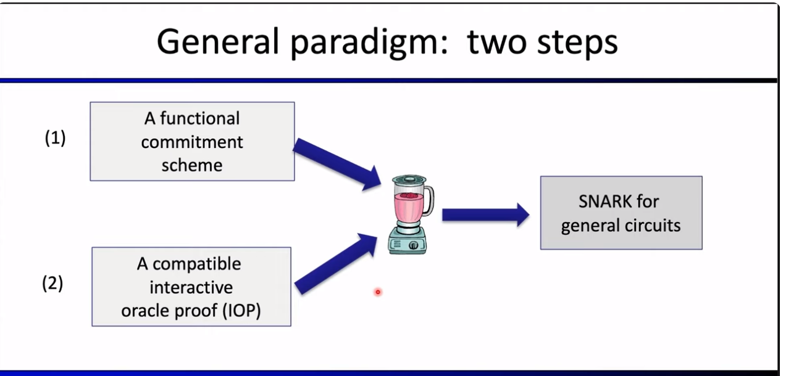
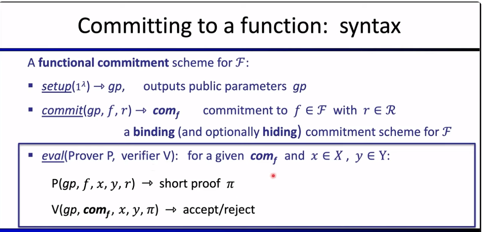
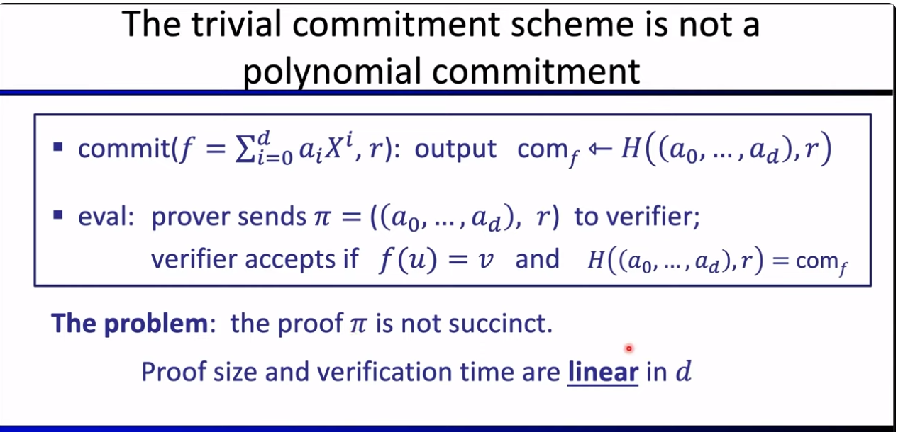
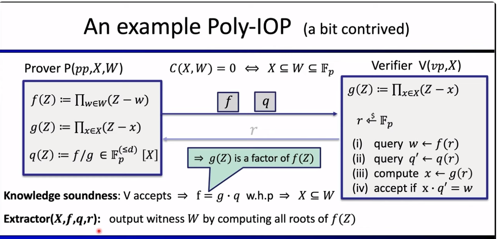
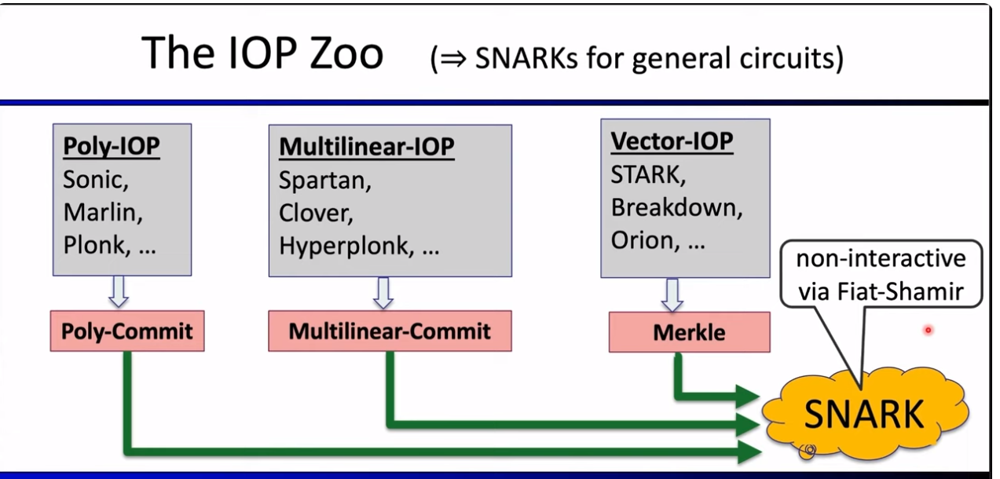

## Homework 11
------------------------------------------------
 Watch this overview of SNARK construction [ZKP MOOC Lecture 2: Overview of Modern SNARK Constructions](https://www.youtube.com/watch?v=bGEXYpt3sj0&list=PLS01nW3Rtgor_yJmQsGBZAg5XM4TSGpPs&index=3)
 
 Dan Boneh's lecture delves into the world of zero-knowledge proofs, specifically focusing on SNARKs (Succinct Non-Interactive Arguments of Knowledge). Here's a detailed summary :

### Overview of SNARKs:
- **Purpose of SNARKs:** SNARKs are succinct non-interactive proofs, providing a compact and quickly verifiable way to prove the truth of a statement.
- **Basic Idea:** A SNARK allows a prover to convince a verifier that they know a certain piece of information without revealing the information itself. This proof is short and fast to verify.
- **Challenges in Traditional Proofs:** Sending the actual data as proof is inefficient, especially when dealing with large datasets. SNARKs address this by offering short and efficient proofs.

### Types of SNARKs:
- **SNARK Properties:** SNARKs should be short and fast to verify. This means the proof's length is not dependent on the size of the underlying data.
- **Zero-Knowledge SNARKs (zk-SNARKs):** In addition to being short and fast, zk-SNARKs ensure that the proof reveals nothing about the actual information being proven. This adds an extra layer of privacy.

### Commercial Interest and Applications:

1. companies who are building Snarks
 
2. companies who are using Snarks

3. hardware companies who are building Snarks accelerators

- **Industry Interest:** Several companies are actively involved in SNARKs, both in software development and hardware acceleration.
- **Blockchain Applications:** SNARKs play a crucial role in blockchain scalability, interoperability, and privacy.
  - **Scalability:** zkRollup allows off-chain processing of multiple transactions, proving their validity with a single short proof.
  - **Interoperability:** SNARKs facilitate the transfer of assets between different blockchains by proving the consensus state.
  - **Privacy:** zk-SNARKs enable private transactions on public blockchains, ensuring compliance with regulations without revealing transaction details.
  - **Solvent Proof:** Exchanges can use SNARKs to prove solvency without disclosing specific asset and obligation details.

### Non-Blockchain Applications:
- **Disinformation Prevention:** SNARKs can be used to prove the authenticity of images in news articles, combating the issue of misleading images. This involves replacing traditional signatures with zk-SNARKs to verify image manipulations without revealing the original data.
- **Technological Advancements:** The ability of SNARKs to efficiently generate proofs for large statements is attributed to advancements in SNARK systems, particularly faster provers.

### Introduction to SNARKs and Computation Model
- **Computation Model:** SNARKs (Succinct Non-interactive Arguments of Knowledge) are cryptographic protocols used for proving the authenticity of knowledge without revealing the actual knowledge. In this lecture, the computation model is based on arithmetic circuits.
- **Finite Field:** Utilizes a finite field, denoted as F, consisting of numbers from 0 to p-1, where p is a large prime. Arithmetic operations like addition and multiplication are performed modulo p.

### Arithmetic Circuits
- **Definition:** An arithmetic circuit is a function that takes input elements from the field and produces an element in the field as output. It is represented as a directed acyclic graph, with inputs labeled by variables and inner nodes labeled by arithmetic operations.
- **Example:** Given an arithmetic circuit with inputs x1, x2, and a fixed input 1, performing addition, subtraction, and multiplication modulo p, the circuit computes a polynomial in the variables x1 and x2.
- **Size of Circuit:** Denoted as the size of C, **indicating the number of gates in the circuit**.

### Applications of Arithmetic Circuits
- **Hash Function:** An example of an arithmetic circuit computing the SHA256 function with about 20,000 arithmetic gates.
- **Signature Verification Circuit:** Another example involves verifying digital signatures, showcasing the versatility of arithmetic circuits.
- **Structured vs. Unstructured Circuits:** Distinguishes between circuits with randomly wired gates and circuits built in layers, often resembling a virtual machine.

### Non-Interactive Arguments of Knowledge (NARKs)
- **Definition:** NARKs consist of three algorithms (S, P, V) for setup, prover, and verifier. The setup algorithm generates public parameters, and the prover convinces the verifier of a valid statement-witness pair.
- **Completeness and Knowledge Soundness:** NARKs must satisfy completeness (verifier accepts valid proofs) and knowledge soundness (if the verifier accepts, the prover must "know" a witness).

### Succinct Non-Interactive Arguments of Knowledge (SNARKs)
- **Introduction:** SNARKs are a subset of NARKs with additional constraints on proof length and verification time.
- **Requirements:** SNARKs demand **short proofs** (sublinear in witness size) and **fast verification** (sublinear in circuit size).
#### **Type of Setup:**

### Examples of SNARK Systems
1. **Groth'16:**
   - Short proofs (200 bytes).
   - Constant verification time.
   - Requires a trusted setup per circuit.

2. **Plonk and Marlin (2019):**
   - Short proofs (400 bytes).
   - Constant verification time.
   - Features a universal trusted setup.

3. **Bulletproofs:**
   - Longer proofs (1.5 kilobytes).
   - Linear verification time.
   - Transparent setup.

4. **SNARKs:**
   - Longer proofs (100 kilobytes).
   - Logarithmic verification time.
   - Transparent setup.

### Knowledge Soundness in SNARKs
- Knowledge soundness ensures that if the prover successfully convinces the verifier (i.e., the verifier accepts the proof generated by the prover), then it is guaranteed that the prover knows a valid witness for the statement being proven. In other words, the protocol is sound if it is computationally infeasible for a dishonest prover to generate a convincing proof for a false statement.

### A general framework for constructing efficient SNARKs (Succinct Non-interactive Arguments of Knowledge).

 - A SNARK is defined by three algorithms: Setup (S), Prover (P), and Verifier (V). The Setup algorithm takes a circuit as input and outputs parameters for both the prover and verifier. The Prover algorithm generates a proof based on a statement and a witness, while the Verifier algorithm decides whether to accept or reject the proof by considering the statement and the proof.

- The primary goal of SNARKs is to provide succinct proofs, meaning that the proof size is ideally logarithmic or constant in the size of the circuit. The verifier's time should also be at most logarithmic in the size of the circuit. 
-  SNARKs can be applied to prove various statements, such as knowledge of a preimage of a hash function, possession of a signature in a specific message, or the validity of an encrypted transaction.
### **SNARK Construction Paradigm:**
- The general paradigm for building SNARKs involves two steps: 
 - a functional commitment scheme and a compatible interactive oracle proof. The functional commitment scheme is a cryptographic object that allows commitment to a function, 

  **Functional Commitment Scheme:**
   - Consists of committing to functions from a predefined family.
   - Commitment allows verification of the function's output at any point in its domain.
   - Uses commit and verify algorithms with **binding** and **hiding** properties.

    1. **Key Components:**
    - Prover commits to a function description, and verifier later checks properties without knowing the function.
    - Evaluation protocol ensures the committed function satisfies specified conditions.
    - Notation: \(f\) in a box refers to the commitment string for the function \(f\).
    
    2. **Functional Commitment Examples:**
        1. **Polynomial Commitment Scheme:** Commits to univariate polynomials of degree at most d.
        2. **Multilinear Commitments:** Commits to multilinear polynomials with degree at most 1 in each variable.
        3. **Vector Commitments:** Commits to vectors, allowing opening of specific elements in the vector.
        4. **Inner Product Commitments:** Commits to a vector, allowing proof of inner product properties.

    3. **SNARK Construction Examples:**
    - Polynomial commitment schemes are crucial for SNARKs.
    - Constructions include KZG'10, Dory, FRI, bulletproofs, and Dark, each with unique features.
    - Notable scheme: KZG'10 is the most widely used scheme due to its efficiency

    4. **Trade-offs in Constructions:**
    - Considerations include proof size, verification time, and the need for a trusted setup.
    - Polynomial commitment schemes aim for logarithmic proof size and efficient verification.

    5. **Challenges and Considerations:**
    - Trivial commitment scheme (committing to all coefficients of a polynomial) is not suitable for achieving succinctness in polynomial commitment.
    

**SNARKs and Interactive Oracle Proofs (IOPs)**

1. **Introduction to IOPs:**
   - IOPs are designed to boost a functional commitment for a specific function family into a SNARK for general circuits.
   - Example: Starting with a polynomial commitment scheme, a polynomial IOP can boost it to a SNARK for circuits with at most \(d\) gates.

2. **Structure of F-IOP (Functional IOP):**
   - Setup procedure preprocesses the circuit, providing public parameters for prover and verifier.
   - Prover and verifier engage in a protocol involving the prover sending oracles (later replaced by commitments) for specific functions.
   - Verifier parameters include functions as oracles for verification.
   - Prover sends oracles, and verifier contributes random data in each round until the prover completes the protocol.

3. **Verification Procedure:**
   - Verifier decides to accept or reject based on the evaluation of functions using oracles, randomness, and statements.
   - The verifier can evaluate functions at any point, and the final decision is made based on these evaluations.

4. **Properties of IOPs:**
   - Soundness: Honest prover convinces verifier if it knows a witness, and a malicious prover cannot deceive if no such witness exists.
   - Knowledge Soundness: Achieved through an extractor that works with the clear functions.
   - Zero Knowledge: Ensures the IOP doesn't reveal additional information about the witness.

5. **Example of Polynomial IOP:**
   - Containment test circuit: Prover aims to prove \(x \subseteq w\) using a polynomial \(f\) with roots in \(w\) and \(g\) with roots in \(x\).
   - Prover sends oracles for \(f\) and \(q\) (quotient of \(f\) and \(g\)), and the verifier queries them at a random point \(r\).
   - Acceptance criterion involves evaluating \(g\) at \(x \times q\) and comparing with \(w\).
   - Extraction involves finding roots of \(f\) to extract \(w\).
 
6. **IOP Zoo and SNARK Construction:**
   - IOPs can be categorized based on the commitment scheme they pair with: Polynomial IOP with polynomial commitment, Multilinear IOP with multilinear commitment, and Vector IOP with vector commitment.
   - Each IOP can be combined with an appropriate commitment scheme to construct a SNARK.

7. **Compilation and Fiat-Shamir Transformation:**
   - The IOP is compiled into a SNARK using a commitment scheme.
   - Fiat-Shamir transformation is applied to make the resulting SNARK non-interactive.

 

 

