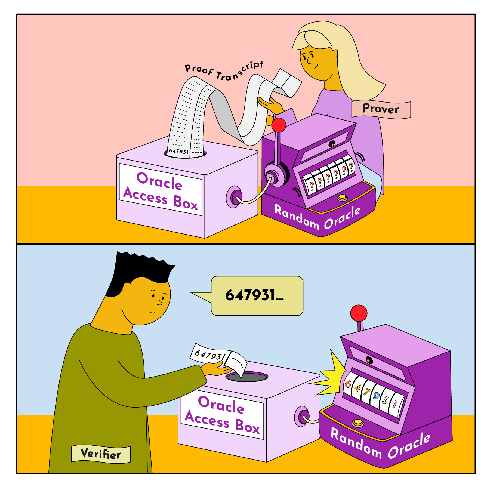

# Proof Systems 
## What’s a Proof System?
In computer science, a “proof” is a formal demonstration that a particular statement is true. Proofs are formalized using “proof systems.” We can break proof systems into **five major pieces**:
1. **Formal Language:** Proof systems convey statements and properties through a formal language
   - can think of as  a precise and standardized syntax for expressing statements.
   - Includes logical connectives, quantifiers, variables, and symbols.

2. **Axioms:**
   - Basic truths or assumptions accepted without proof.
   - Serve as the starting point for constructing proofs.

3. **Inference Rules:**
   - Inference rules define how one statement can be transformed into another following the principles of logic.

4. **Proof Derivation:**
   - Involves step-by-step derivation from axioms using inference rules then, brings us to our final assertion.

5. **Soundness and Completeness:**
   - Soundness  guarantees that proof systems don’t produce false results, while completeness ensures that true statements are accepted within the proof system.

## Evolution of Proof Systems:
1. **Nondeterministic Polynomial-time (NP):**
    - **NP (Nondeterministic Polynomial Time):**
        - NP is a class of decision problems that have a fascinating property:
            - If someone gives you a solution (a "yes" answer), you can check its correctness quickly (in polynomial time).
            - However, finding the solution itself might be difficult and may not have an algorithm that runs in polynomial time. 
    - **Polynomial Time:**
        - "Polynomial time" refers to the efficiency of algorithms that solve or verify problems.
        - An algorithm is said to run in polynomial time if the time it takes to complete is a polynomial function of the size of the input.
        - A polynomial function is something like n^2, n^3, etc., where 'n' is the size of the input.

    -  **Nondeterministic Computation:**
        - Nondeterminism is a theoretical concept allowing a machine to make guesses in a way that is not practically achievable in real computers.
        - A "nondeterministic Turing machine" can make guesses to solve a problem and then verify the solution in polynomial time.

In this case, the prover simply provides a potential coloring assignment for the graph, and the verifier checks its validity by verifying all the vertices and ensuring no two adjacent vertices have the same color. That’s it!

2. **Interactive Proof (IP):**
   - Introduces interaction between prover and verifier.
   - Prover convinces verifier through random challenges, enabling probabilistic verification.

3. **Probabilistic Checkable Proofs (PCP):**
   - Non-interactive evolution of NP proof system.
   - Proofs transformed into fixed-size format, and verifier queries random bits in the transcript.

   The prover constructs a proof transcript that encodes the coloring assignment. The verifier queries for the vertices of the graph using the randomness provided by the oracle, and gets access to the color at those vertices via the oracle. Based on the results of the queries, the verifier can choose to either accept or not accept. Note that there is NO interaction in this case. The prover simply generates the proof transcript once, and the verifier uses random queries via the oracle to validate the proof.
   

4. **Interactive Oracle Proof (IOP):**
   - Extends IP with random oracles for more efficient interaction.
   -  in an IOP, the prover and the verifier interact with one another and have access to random oracles.

   Similar to PCP, the prover constructs a proof transcript that encodes the coloring assignment, and the verifier queries for the vertices of the graph randomly using the oracle. The oracle gives the verifier access to the color at those queried vertices. But rather than sending the entire proof transcript at once, as with PCPs (which is inefficient), IOP breaks it up and sends small parts of it over multiple interactions until the verifier is convinced the prover knows the solution.
   

Summary:
- IP = Interaction + Randomness
- PCP = Randomness + Oracle Access
- IOP = Interaction + Randomness + Oracle Access

## Proof System + Cryptography = SNARKS / STARKS
 
 In the context of zkSNARKs and zkSTARKs, the relationship between a proof system and cryptography can be understood through two main components: Information-Theoretic Proof Systems and Cryptographic Compilers.

1. **Information-Theoretic Proof System:**
   - **Definition:** This type of proof system is characterized by its ability to provide soundness and completeness even when facing adversaries with unbounded computational power.
   - It makes idealized assumptions that are challenging to enforce in the real world, such as trusting the verifier and assuming restricted access to the proof.
   - An information-theoretic proof system is not practically useful as a standalone object due to its reliance on ideal conditions.

2. **Cryptographic Compiler:**
   - **Purpose:** This component removes the idealized assumptions made by the information-theoretic proof system.
   - **Mechanism:** It achieves this by employing cryptographic primitives, like collision-resistant hash functions, random oracles, or generic bilinear groups.
   - **Output:** The result is a real-world proof system that remains secure under the assumption of a computationally bounded prover and/or verifier, a common assumption in cryptographic protocols.
   - **Additional Properties:** The cryptographic compiler can impart other desirable features to the information-theoretic proof system, including eliminating interaction, reducing communication complexity, or introducing a zero-knowledge feature.

**Why the Separation?**
   - **Modularity:** The separation exists for modularity, allowing each part to be analyzed, optimized, and implemented independently.
   - **Optimization:** Information-theoretic proof systems can be optimized based on information theory principles. Various cryptographic compilers can then be applied to create different real-world proof systems, each with its own tradeoffs in terms of efficiency, security, and trusted setup assumptions.

 