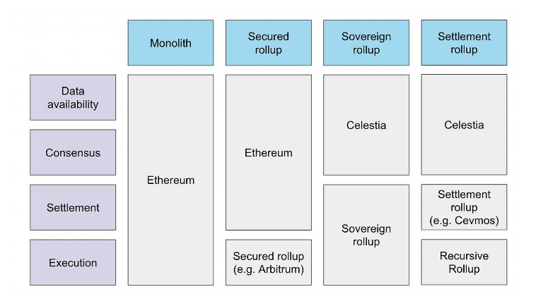
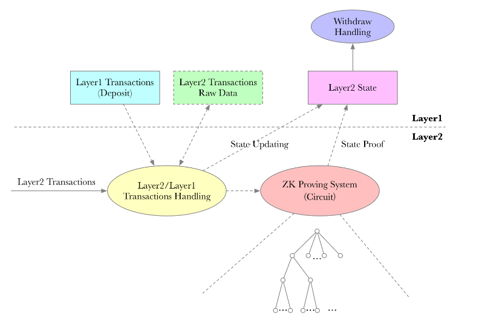
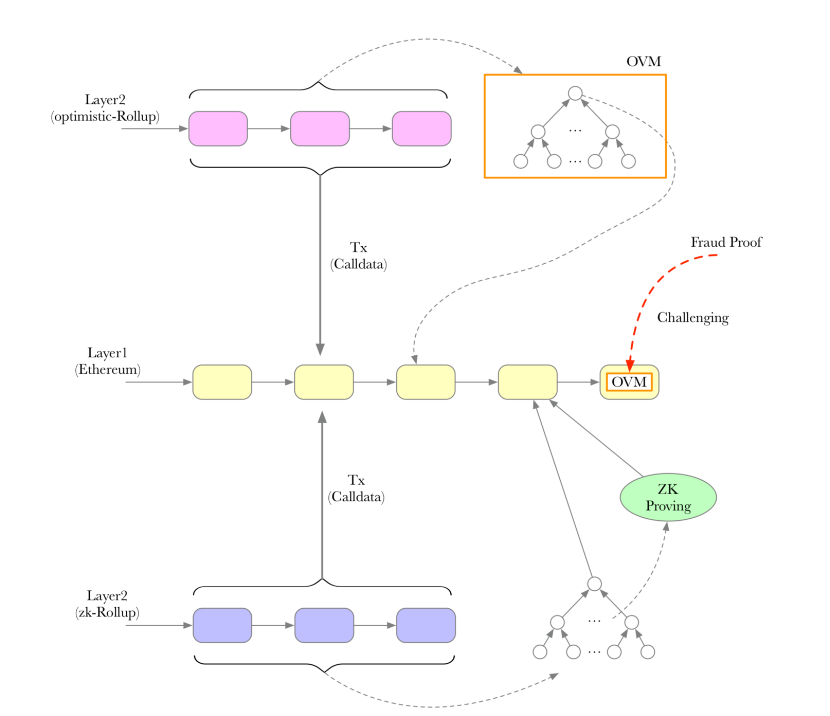

# (Almost) Everything about Rollup

Rollup is a layer 2 scaling solution for Ethereum. 
There are two ways to scale a blockchain:
1. To optimize the blockchain itself
 2. To use the blockchain in a better way.( rollup)

> Rollup is: an on-chain smart contract + an off-chain aggregator.
1. **On-chain smart contract**, which means that its trust model is a smart contract on Ethereum, that borrows the security of Ethereum. We can trust Arbitrum’s protocol in the same way that we trust Uniswap’s protocol (which is a smart contract at its core).

2. **Off-chain aggregator**, which means it will execute and aggregate transactions off-chain, compressing large volumes of transactions and eventually putting them on the Ethereum mainnet for the purpose of making transactions faster and cheaper.

## Types of Rollups :
1. **Secured Rollup** is a Rollup model like Arbitrum or Optimism
 2. settlement Rollup
 3. consensus Rollup
 4. data availability  Rollup
 all rely on L1s like Ethereum, and only handle the execution itself.

# Mechanism
> L1:
each node stores and executes every transaction submitted to it, so such a decentralized network is very expensive.

> L2:
1. Optimistic Rollup represented by Aribitrum and Optimism
    uses a presumption of innocence, where everyone will believe by default that each execution is correct, and security is ensured by the fact that each batch state can be challenged by fraud proof.
    ### How it works:
    - Users submit transactions in Arbitrum network, 
     - Arbitrum’s sequencer executes the transactions, 
     - submitting the complete state root and transaction data in batches to a smart contract on the Ethereum mainnet.!
     [Alt text](image-8.png)
        -  What if the Optimistic Rollup execution generates errors?
        Optimistic Rollup has a **dispute validation cycle**, which means that the data will not be finalized until, say, a week after it is uploaded, during which time anyone can challenge it and prove that the batch is incorrect.
 2. Mechanism of zk Rollup
    uses zk zero-knowledge proof technology (actually Validity Proof). It uses the presumption of guilt, where people will default to questioning that each execution is wrong, and security is ensured by the proofs contained in each batch.
    ### How it works:
    - Users submit transactions in zkSync,
    - the sequencer of zkSync executes and stores the transactions, and submits the proof of state and the new state in batches to the smart contract on the Ethereum mainnet in full.
    How can zk prove that execution is not wrong?

### How can zk prove that execution is not wrong?
Prover (or sequencer in most cases) generates unforgeable proofs of the execution of transactions, **proving that these new states and executions are correct**. Sequencer compresses the proofs and other data and submits them to the smart contracts in the Ethereum mainnet for verification.
### How do they compress data, thereby reducing gas fees?

Rollup can be compressed in terms of the number of bytes per transaction, including nonce and signature, etc. For zk Rollup, it can further **compress the data that is not relevant to the state update, because zk proofs can already prove the correctness of the state update**, 

while **Optimistic Rollup cannot ignore this data** because it **needs to be able to be challenged**.
### Why do the data uploaded to mainnet need to be **in full** (for a Secured Rollup)?

Because in order to **prevent sequencer escapes**, we can **rebuild the entire Layer 2 from data on Ethereum**. This relates to the concept of data availability.

## Differences of Two Types of Rollups

in brief, Optimistic Rollup uses a **challenge period to ensure that errors can be corrected**, and ZK Rollup **uses cryptography to ensure that errors cannot occur**.

## references
- https://mirror.xyz/msfew.eth/WQJaOcFkpTOZLns8MBQaCS4OepRoaZ7uoctnLAnalVw
