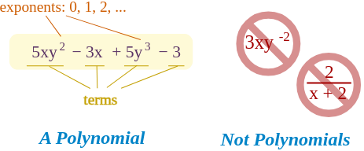
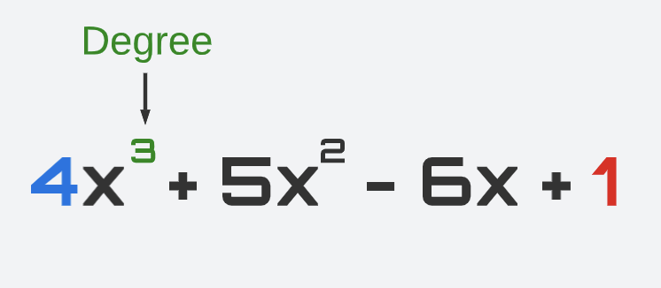
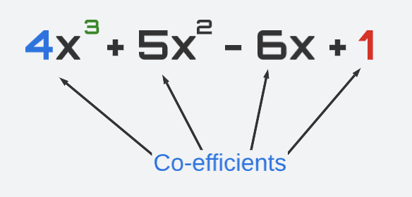
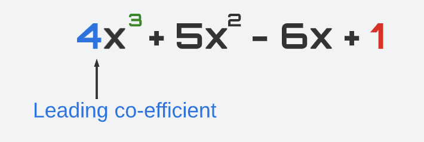
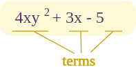

## Understanding polynomials

**What are Polynomials?**

Polynomials are mathematical expressions represented by terms with coefficients and variables. 

Polynomial comes from poly- (meaning "many") and -nomial (in this case meaning "term") ... so it says "many terms"
The degree of a polynomial is the highest power of the variable. Examples include linear (degree 1), quadratic (degree 2), and cubic (degree 3) polynomials.

### Polynomial or Not?

### **Terminology:**

1. **Degree:** The highest power of the variable in a polynomial.
2. **Coefficients:** Numerical values in front of each term.
3. **Leading Coefficient:** The coefficient of the term with the highest degree.
4. **Roots (Zeros):** Values making the polynomial zero.
5. **Factorization:** Expressing a polynomial as a product of simpler polynomials. example:\(x^2-9) could be factored as (x+3)(x-3)\ and easily  find the root and solve it for x=3 and x=-3.

   ## References
   - https://www.zkcamp.xyz/blog/you-cant-understand-zkps-without-understanding-polynomials
   - https://www.mathsisfun.com/algebra/polynomials.html 
