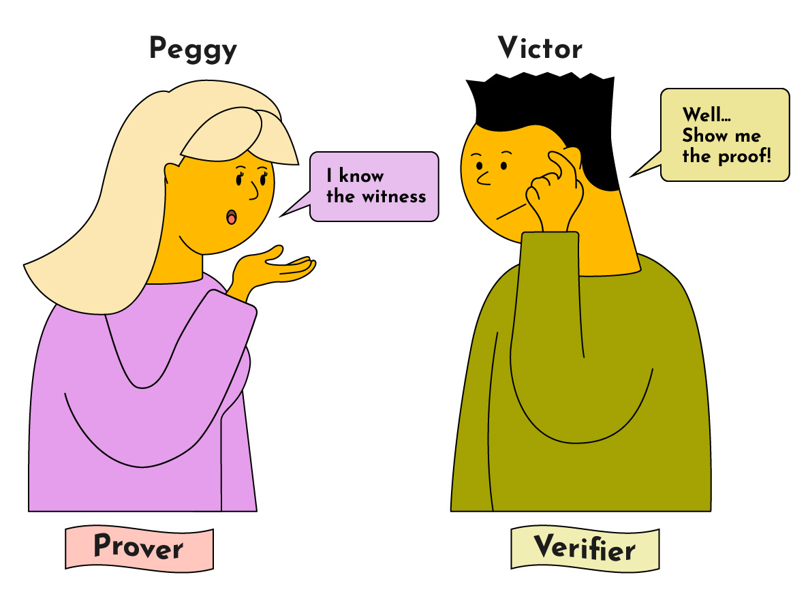

## What is a Zero-Knowledge Proof?
A zero-knowledge proof is a method that allows one party (Peggy) to prove to another (Victor) that she knows a secret value that fulfills some constraints — without revealing any additional information to Victor, only that she knows this secret value.

In a zero-knowledge protocol, we refer to the secret value as the “witness” and the two parties as the “Prover” and “Verifier”.

**Prover**: The prover (“Peggy”) wants to prove to the verifier (“Victor”) that she knows the witness without revealing the witness.
**Verifier**: The verifier (“Victor”) needs to verify that the prover does know the witness without revealing the witness to himself or anyone else.

### For a zero-knowledge protocol to be valid, it has to satisfy three properties:
 -**Completeness**: If the proof is valid, it must be accepted by the verifier (ie. a correct proof is always accepted).
- **Soundness**: If the proof is invalid, it must be rejected by the verifier (ie. the probability that a verifier accepts an incorrect solution is negligible).
- **Zero-Knowledge**: The verifier does not learn any information about the information that the prover claims to know other than the assertion that she knows it.

### zk-SNARK 
Zero-Knowledge Succinct Non-Interactive Argument of Knowledge (zk-SNARK) proofs play a crucial role in solving problems without revealing sensitive information. The acronym is broken down as follows:

- **ZK (Zero Knowledge):** Proving a fact without disclosing the actual information.
- **S (Succinct):** Even for large programs, proofs are small and can be quickly verified.
- **N (Non-interactive):** No back-and-forth communication is needed between the prover and verifier; a proof is presented, and its validity is determined.
- **AR (Argument):** For technical reasons, the proofs are called “arguments” because they are not technically “proofs” in the traditional sense.
- **K (Knowledge):** This refers to the information that the prover knows.

A zk-SNARK involves three algorithms: Setup, Verify, and Prove.

**Setup:**
The Setup algorithm generates two keys – proving key ("pk") and verification key ("vk") – using a secret parameter ("lambda") and a program C. These keys are public and used by the prover and verifier.

**Prove:**
The Prove algorithm generates a zero-knowledge proof using the proving key ("pk"), a private witness "w," and a public value "x." The witness is the secret information, and "x" is derived from "w" but is obfuscated to maintain privacy.

**Verify:**
The Verify algorithm assesses the correctness of the proof, taking the verification key ("vk"), public value "x," and the proof as inputs.
 

 Summary:

**Step 1: Generate the Program/Constraints**
Define the program's constraints, specifying the desired knowledge. In this case, the constraint is that the hash of "w" must be equal to "x."

```javascript
function C(x, w) {
  return sha256(w) == x;
}
```

**Step 2: Generate Keys**
Select the secret parameter "lambda" carefully. The generation of keys involves a trusted setup phase, ensuring that the lambda value is not leaked, as its exposure could lead to the creation of fake proofs.

```plaintext
(pk, vk) = Setup(lambda, C)
```

**Step 3: Generate Proof**
Using the proving key, the hash of the secret value, and the secret value, Peggy creates the proof.

```plaintext
proof = Prove(pk, sha256(w), w)
```

**Step 5: Verify the Proof**
Verifier takes the proof, the hash of the secret value, and verification key and runs it through the verification algorithm to figure out whether the proof is valid or not.

```plaintext
Verify(vk, sha256(w), proof)
```

## References
- https://www.zkcamp.xyz/blog/what-is-a-zkp-anyway 
